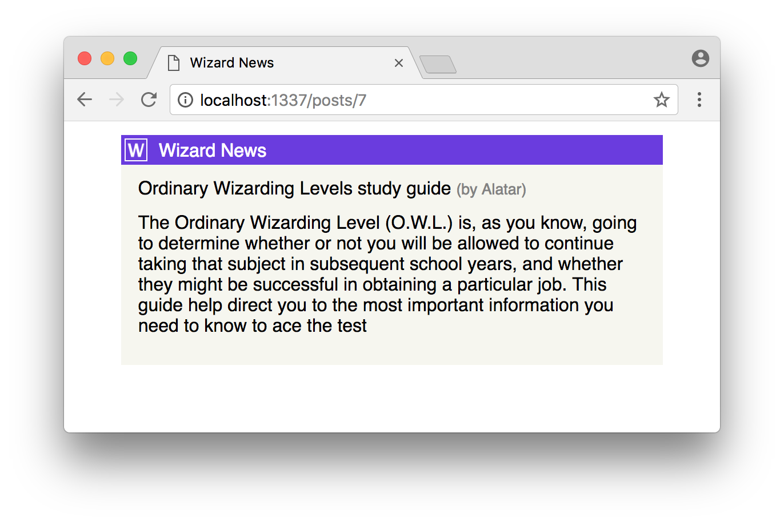

# Wizard News

## What we will build:

1. A homepage similar to [Hacker News](https://news.ycombinator.com/) that shows a list of news articles.
2. A Detailed view of any news article that the reader clicks on from the homepage.

Important note: Right now, there will be no persistent database in our application; we will simply be using a JavaScript array to hold objects in the server's RAM.

## Instructions

1. Setup a basic Express project.
   1. Setup your project as a node project so you can install npm packages
   2. Install express to build the server using the express framework, morgan to aid with development so you can see helpful messages in your console, nodemon so that your server automatically restarts when you save changes (don;t forget to reload the browser though!), and cors to prevent security related errors.
   3. Add two scripts in your package.json file, one for running your server in development mode using nodemon, and another for deployment using just node.
2. Use included files.
   1. Add a `public` folder and copy the logo file and stylesheet into that folder.
   2. Copy the `postBank.js` file into your root
3. Setup your index.js file.
   1. Require the packages you've installed similar to the setup from yesterday's lesson.
   2. Make your app listen to port 3000 (or choose another port if that one is already taken. You will know if it is when your start getting errors telling you so.).
   3. Add `const postBank = require("./postBank")`. This will allow you to call the `list` and `find` functions and use the data stored inside the `postBank.js` file.
   4. Add `app.use(express.static(__dirname + "/public"))`. This will allow you to use the static stylesheet you added earlier when referencing it in your html code inside your future get routes.
4. Create the get route for the homepage
   1. Create a get route in your `index.js` file for the root path. Send back a quick test message and test your server to make sure it is working and you can see that message. If all is working fine, you may continue. 
   2. Inside the route, get the news posts by adding `const posts = postBank.list()`
   3. After the previous line, create a new const variable that stores the following html. Wrap it in back ticks instead of quotes to use string interpolation.
   ```js
   <!DOCTYPE html>
   <html>
   <head>
       <title>Wizard News</title>
       <link rel="stylesheet" href="/style.css" />
   </head>
   <body>
       <div class="news-list">
       <header>Wizard News</header>
       ${posts
         .map(
           (post) => `
          <div class='news-item'>
          <p>
          <span class="news-position">${post.id}. ▲</span>${post.title}
          <small>(by ${post.name})</small>
          </p>
          <small class="news-info">
          ${post.upvotes} upvotes | ${post.date}
          </small>
          </div>`
         )
         .join("")}
       </div>
   </body>
   </html>
   ```
   4. Send back the above html as the result. Test it out!
5. Create the get route for the individual post view
   1. Create a second route at the `/posts/:id` path in the same file.
   2. Add `next` to the parameters of that route, so next to req and res. This way you will be able to redirect to your error path if anything goes wrong.
   3. Get the post with the given id by calling the find function from postBank.
   4. Check to see if the post doesn't exist by checking of it has an id (`if(!post.id){...}`). If it doesn't, call `next()`. The next function will go to the next matching path in your routes.
   5. Create a function at the `*` route to catch errors and send the following:

   ```js
   <!DOCTYPE html>
   <html>
   <head>
     <title>Wizard News</title>
     <link rel="stylesheet" href="/style.css" />
   </head>
   <body>
     <header>Wizard News</header>
     <div class="not-found">
       <p>Accio Page! 🧙‍♀️ ... Page Not Found</p>
     </div>
   </body>
   </html>
   ```
   6. if the post does exist, send back html that displays the single post with additional details. Feel free to reuse some of the previous html code for displaying a list of posts to achieve this. It should look similar to this:
   
6. Add the button click!
   1. Update your post mapping function to include a link to the post details route using `<a href="/posts/${post.id}">${post.title}</a>`.
   2. Test out your project!
7. Deployement
   1. When uploading to github, make sure you have a `.gitignore` file with `node_modules` in it so you don't upload the packages.
   2. Follow the server deployment instructions for Render in [learndot](https://learn.fullstackacademy.com/workshop/635834a94df0c400049f3dd1/content/635835684df0c400049f3e22/text).
   3. The build command should be `npm i` and the start command `npm start`. Remember there is no database so skip database related steps.
# wizardnews
